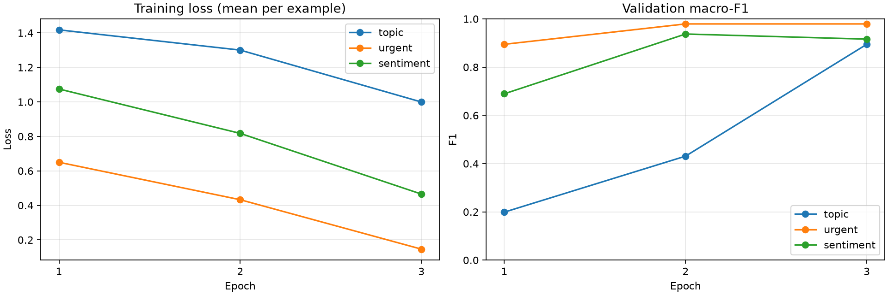
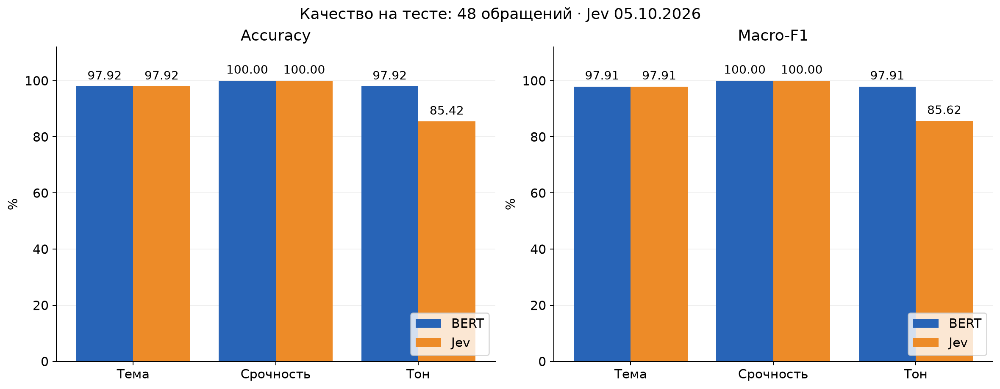
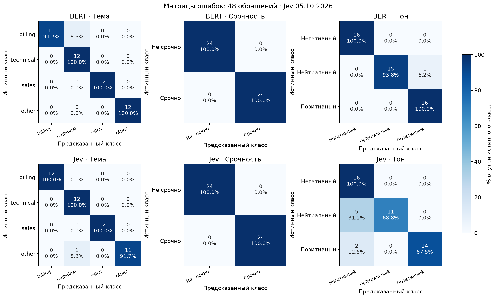
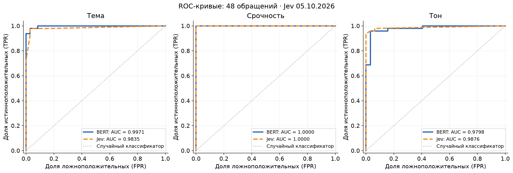
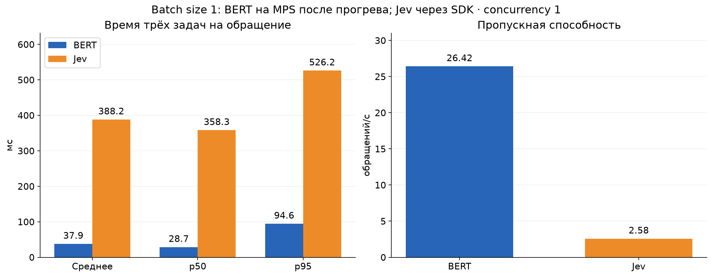

# Сравнение дообученного BERT и Jev

## Цель эксперимента

Сравнить качество и скорость дообученного BERT и Jev без дообучения на одном тестовом наборе обращений в поддержку. Замеры BERT выполнены 4 октября 2026 года; результаты Jev обновлены по запуску 5 октября 2026 года через официальный асинхронный SDK TypeSafe.

## Задача

По тексту обращения определить три признака: тему (`billing`, `technical`, `sales`, `other`), срочность (0/1) и тон (негативный, нейтральный, позитивный). Тема определяется главной просьбой; срочность — немедленной потребностью в помощи или текущей остановкой работы; негативный тон требует выраженного недовольства, а не просто описания проблемы.

## Датасет

`authored-v2-en` содержит 240 индивидуально написанных ассистентом синтетических англоязычных обращений.

| Часть | Обращений | Доля | На каждый класс темы | На каждый класс срочности | На каждый класс тона |
|---|---:|---:|---:|---:|---:|
| Train | 144 | 60% | 36 | 72 | 48 |
| Validation | 48 | 20% | 12 | 24 | 16 |
| Test | 48 | 20% | 12 | 24 | 16 |

В каждой части представлены все 24 сочетания меток. Пересечений ID и групп, полных дубликатов текстов и повторяющихся предложений между частями нет; это не исключает смысловую близость примеров. Обе системы оценены на одинаковых 48 тестовых обращениях, что подтверждено ID, разметкой и хешем датасета в телеметрии.

## Системы

BERT — три отдельно дообученных классификатора `google-bert/bert-base-uncased` (3 эпохи, learning rate 2×10⁻⁵, train batch size 8, seed 42, лучшие веса по validation macro-F1), а Jev — API-модель `jev-1.13.0` в режиме zero-shot с тремя вопросами в одном запросе, порогом срочности 0,5 и выбором тона через argmax вероятностей.

## Результаты сравнения

### Качество

| Задача | Accuracy BERT | Accuracy Jev | Macro-F1 BERT | Macro-F1 Jev | Ошибок BERT / Jev |
|---|---:|---:|---:|---:|---:|
| Тема | 97,92% | 97,92% | 0,9791 | 0,9791 | 1 / 1 |
| Срочность | 100% | 100% | 1,0000 | 1,0000 | 0 / 0 |
| Тон | **97,92%** | 85,42% | **0,9791** | 0,8562 | **1 / 7** |

Все три признака одновременно определены верно у **46/48 обращений BERT (95,83%)** и **40/48 Jev (83,33%)**.

Все семь ошибок Jev по тону — ложный негатив: пять нейтральных и два позитивных обращения. На этих примерах модель связывает срочность и описание сбоя с недовольством, даже когда выражена благодарность. Единственная ошибка BERT по тону — нейтральное обращение, отнесённое к позитивным. По теме BERT перепутал `billing` с `technical`, Jev — `other` с `technical`.

Строки — истинные классы, столбцы — предсказанные; в ячейках указаны число обращений и процент внутри строки. Единая шкала цвета позволяет сравнивать задачи с разным числом примеров на класс.

| ROC-AUC | BERT | Jev |
|---|---:|---:|
| Тема, macro one-vs-rest | 0,9971 | 0,9835 |
| Срочность | 1,0000 | 1,0000 |
| Тон, macro one-vs-rest | 0,9798 | 0,9876 |

Для темы и тона показано макроусреднение ROC-кривых one-vs-rest с равным весом классов; для срочности положительный класс — «срочно». Площадь под каждой кривой соответствует AUC в таблице; пунктирная диагональ обозначает случайный классификатор.

ROC-AUC BERT рассчитан по сохранённым вероятностям; у Jev высокий ROC-AUC тона сочетается с более слабым выбором класса через argmax, поэтому изменение правила принятия решения стоит проверять на validation.

### Скорость и стоимость

| Метрика для трёх задач на обращение | BERT | Jev |
|---|---:|---:|
| Среднее время | **37,9 мс** | 388,2 мс |
| Медиана, p50 | **28,7 мс** | 358,3 мс |
| p95 | **94,6 мс** | 526,2 мс |
| Суммарное измеренное время для 48 обращений | **1,817 с** | 18,635 с |
| Пропускная способность | **26,42 обращения/с** | 2,58 обращения/с |
| Ошибки выполнения | 0 | 0 |

BERT измерен на Apple MPS с batch size 1 после пяти прогревочных вызовов на задачу: время включает токенизацию и inference, исключает загрузку моделей и является суммой отдельных измерений трёх классификаторов, а не временем единого сервисного вызова. Jev измерен с batch size 1 и concurrency 1: один HTTP-запрос включает три вопроса, сеть, проверку ответа SDK и сериализацию результата. Клиент переиспользуется на весь запуск, автоматические повторы отключены. В этих условиях BERT быстрее **примерно в 10,3 раза по среднему времени**.

Сохранённая оценка стоимости Jev по usage и тарифу из телеметрии — **$0,001008 за 48 обращений**, или около **$21 за миллион** при том же размере запросов; это оценка, а не счёт сервиса. Затраты на обучение и инфраструктуру BERT не измерены.

В предыдущем замере Jev средняя задержка составляла 981,7 мс, медиана — 946,0 мс, p95 — 1 006,7 мс. В новом запуске среднее время уменьшилось примерно в 2,53 раза, а суммарное время запросов — с 47,121 до 18,635 с. Accuracy и macro-F1 остались прежними; ROC-AUC темы и тона немного изменился. Замеры выполнены в разные дни, поэтому влияние SDK нельзя отделить от изменения сети и нагрузки сервиса.

Исходные ответы — `results/jev_en.jsonl`, телеметрия Jev — `results/telemetry/jev-20261005T150659.578242Z`.
